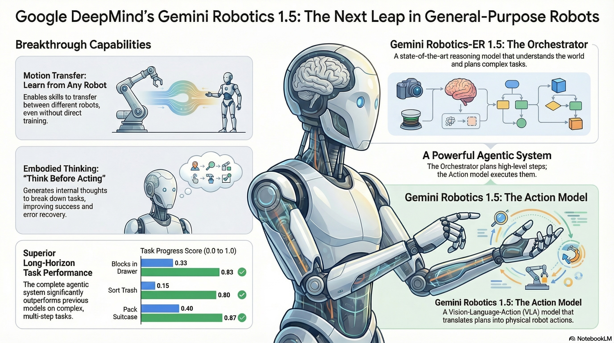

# GeminiロボティクスでAIロボットシミュレーション
**AI Robot Simulation with Gemini Robotics**

(Work in progress)

This project explores AI robot simulation using the Gemini API.

## 1. クレーンゲームロボティクス (Crane Game Robotics)

=> [README](/cranegame)

## 2. 多間接ロボット (Articulated Robot)

=> [README](/robotics)

## Gemini API

### Gemini API C# スクリプト (Gemini API in C# Script)

This code was generated with gemini-2.5-flash referring to the Gemini API doc for REST:

[`Gemini.cs`](/robotics/Assets/Scripts/lib/Gemini.cs)

### Infographics on Gemini Robotics

Generated with NotebookLM on [Gemini Robotics 1.5: Pushing the Frontier of
Generalist Robots with Advanced Embodied
Reasoning, Thinking, and Motion Transfer](https://arxiv.org/pdf/2510.03342)

## Misc

### Robot Scene in Unity

Work on the robot scene in Unity has recently begun.

https://github.com/user-attachments/assets/5b8cf89e-a132-40f8-8c07-1bc9a24380b4

### Robot Scene in Godot (Discontinued)

Initially, Godot was considered for this project. However, due to its limitations in 3D capabilities, development was shifted to Unity. While Godot is a preferred engine for many use cases, it was not suitable for the 3D requirements of this simulation.

https://github.com/user-attachments/assets/52b701a5-fe86-44a4-b6d0-b4fb5e340124

## References

- [Gemini Robotics Overview](https://ai.google.dev/gemini-api/docs/robotics-overview?_gl=1*1lzll2v*_up*MQ..&gclid=CjwKCAiA_orJBhBNEiwABkdmjD7r9CFuZHP7R-rxSMY2zKyRX-Tw3V5xUH2feDADA1mCxsFDtQjQxxoCq18QAvD_BwE&gclsrc=aw.ds&gbraid=0AAAAACn9t67tI7rvJei_ADOP4vnyAYNGl)
